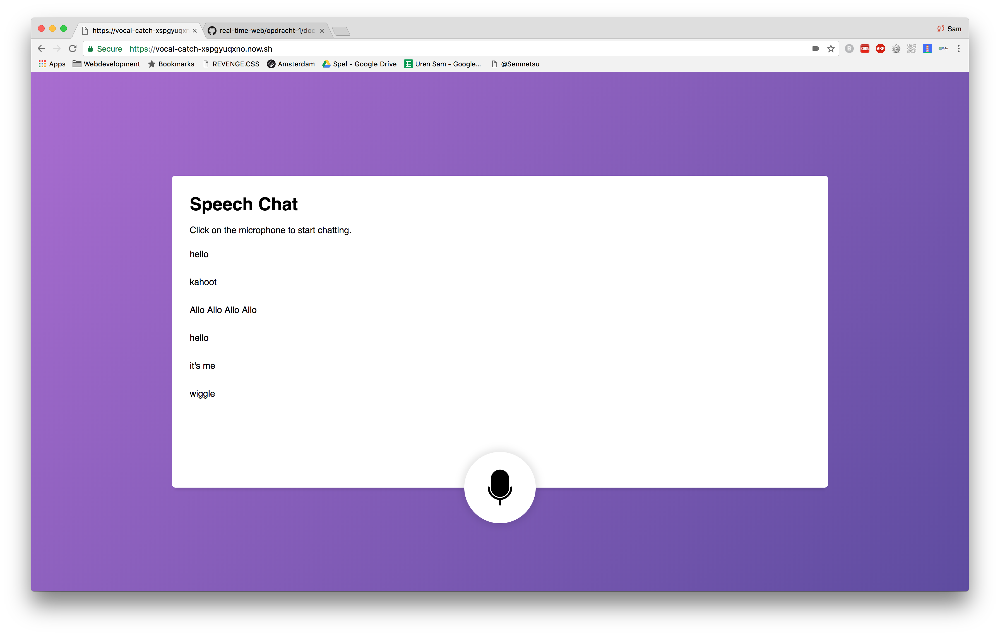

# Voice input chat
This is a chat using your voice to input the text instead of typing. The application is a Real-time app using voice recognision from the browser.

# Table of Content
- [Getting started](#getting-started)
- [Features](#features)
- [Used technology](#used-technology)
- [Bugs](#bugs)
- [Todo](#todo)

# Getting Started
How to get started with this project:

1. Clone the repo with `git clone https://github.com/Sam-Guliker/real-time-web.git` or download it from github
2. Navigate to the project with `cd opdracht-1`
3. Run `npm install` or `yarn` to install the dependencies
4. Run `npm start` to start the server
5. Go to [http://localhost:3000/](http://localhost:3000/)

# Features
The following is possible with this application:

- Chat with other people in the chatroom
- Use your voice instead of typing to communicate.

# Used Technology
The following is used in this project:

- [socket.io][socket] for the real time exchange
- [nodemon][nodmeon] for restarting the server on file change
- [pug][pug] as template engine
- `webkitSpeechRecognition` for the speak recognision
- [Now][now] using for deployment

# Bugs
The following bugs are still present:

- [ ] After saying the input you can change the value of the result the voice api gives back and use it as a regular chat input.  

# Todo
This is what is left to do.

- [ ] The ability to use it as a normal chat if the user does not want to use the voice api
- [ ] Give the user feedback

- [x] Deploy the app. 

[now]: https://zeit.co/now
[socket]: https://socket.io/
[nodemon]: https://nodemon.io/
[pug]: https://pugjs.org/
